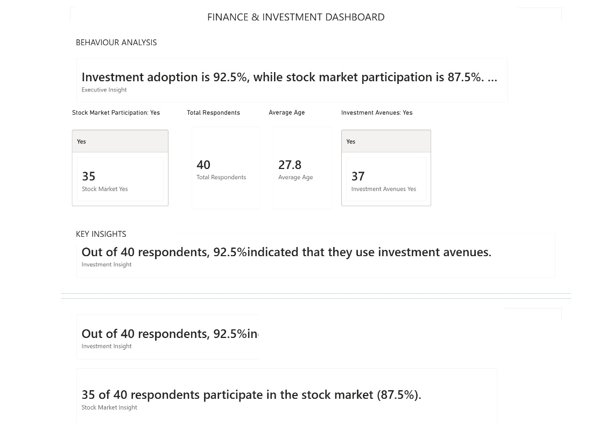

# finance-investment-dashboard
Power BI Finance &amp; Investment Dashboard – Data Analyst Portfolio Project
# Finance & Investment Dashboard

## Project Overview

This project presents an interactive Finance & Investment Dashboard
developed using Microsoft Power BI.

The dashboard analyses investment behaviour, demographic information,
investment preferences and financial decision-making patterns.

## Tools Used

- Microsoft Power BI
- DAX
- Data Cleaning
- Data Modelling
- Data Visualization
- Microsoft Excel

## Dashboard Preview

## Business Questions

- What are the most popular investment avenues?
- Which demographic groups are most likely to invest?
- What factors influence investment decisions?
- What are the most common financial goals?
- How do investment preferences differ across demographic groups?

## Key Insights

The dashboard provides an interactive view of investment behaviour
and allows users to explore patterns across different demographic
and financial characteristics.

## Skills Demonstrated

- Data Analysis
- Data Visualization
- Power BI
- DAX
- Data Modelling
- Business Intelligence
- Data Storytelling

## Project Files

### Dashboard

The Power BI dashboard file is located in:

`Dashboard/Finance_Investment_Dashboard.pbix`

### Dataset

The dataset used for the analysis is located in:

`Data/finance_investment_dataset.csv`

### Dashboard Image

A preview of the dashboard is located in:

`Images/dashboard-overview.png`

## Author

Ayomi Murray
